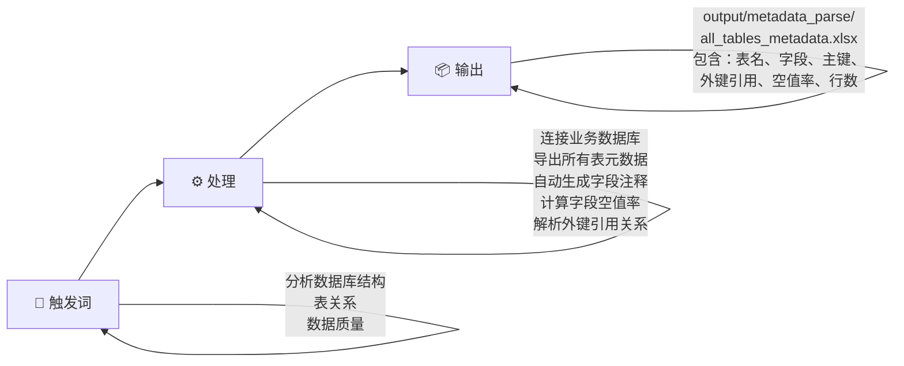
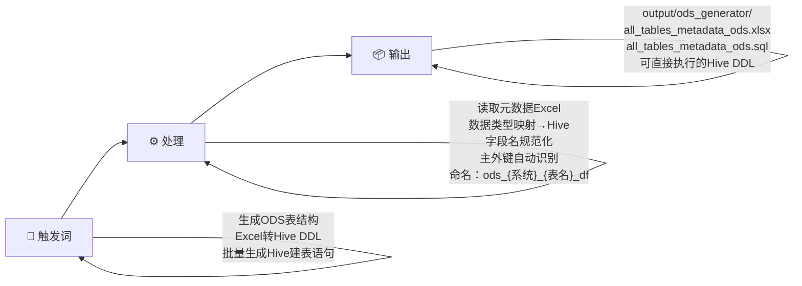
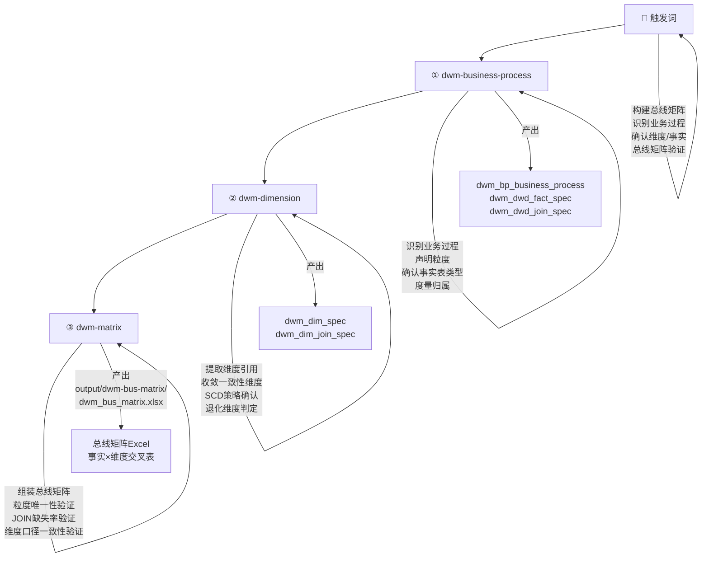
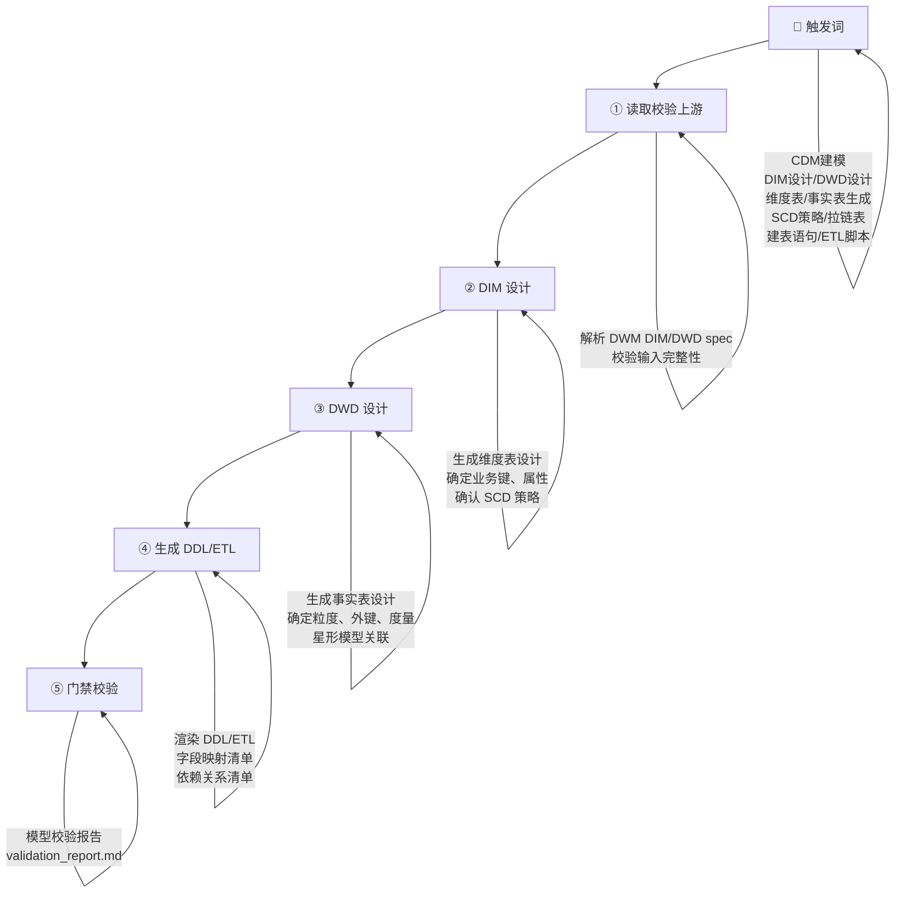
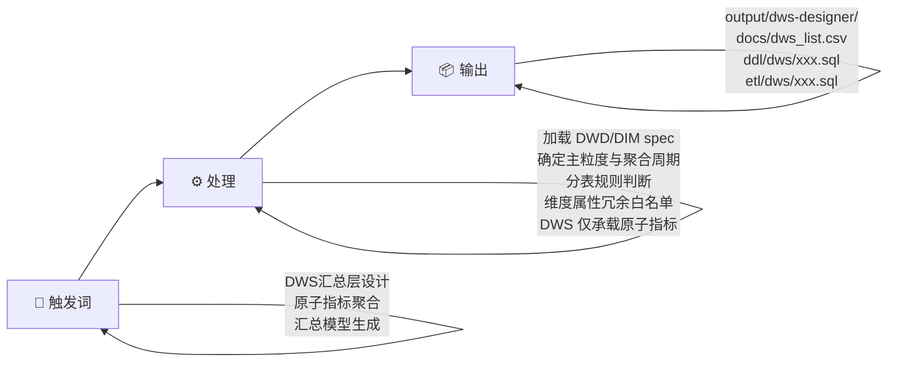

# 数据仓库建设

基于 Kimball《数据仓库工具箱》与《阿里巴巴大数据之路》方法论，从 0 到 1 构建数据仓库。

## 目录结构

```
Data-Warehousing/
├── input/          # 输入：数据库连接配置、词根参考等
├── output/         # 输出：各阶段产出（DDL、ETL、总线矩阵等）
└── sub-skills/     # 负责各环节的 skill 定义与脚本
```

## 总体流程

整体遵循五步递进，每一步的产出是下一步的输入：

1. **元数据补全**（`metadata_parse`） — 连接业务库，导出表结构、字段、主外键、空值率
2. **ODS 贴源层**（`ods-generator`） — 基于元数据生成贴源层 Hive DDL
3. **总线矩阵**（`dwm-*`） — 识别业务过程、确认维度与事实，组装总线矩阵
4. **CDM 建模**（`cdm_modeling`） — 生成 DIM/DWD 模型、建表语句和 ETL
5. **DWS 汇总层**（`dws-designer`） — 基于 DIM/DWD 生成原子指标汇总模型

详细每个步骤的设计、触发词、输入输出见下方建设流程。

## 建设流程

### 步骤1：元数据补全

> **涉及 skill**：`metadata_parse`



| 项目 | 说明 |
|------|------|
| 输入 | `input/metadata_parse/config.yaml`（数据库连接信息） |
| 核心逻辑 | 连接业务库 → 遍历所有表 → 提取字段/注释/主外键/空值率 → 输出 Excel |
| 输出 | `output/metadata_parse/all_tables_metadata.xlsx` |
| 效果 | 一份完整的基础元数据档案，字段角色、外键引用关系、数据质量一目了然 |

---

### 步骤2：ODS 层生成

> **涉及 skill**：`ods-generator`



| 项目 | 说明 |
|------|------|
| 输入 | `output/metadata_parse/all_tables_metadata.xlsx` |
| 核心逻辑 | 读取元数据 → 类型映射（VARCHAR→STRING 等） → 字段规范化 → 生成 `ods_{系统}_{表}_df` 格式的 DDL |
| 输出 | `output/ods_generator/xxx_ods.xlsx`、`xxx_ods.sql` |
| 效果 | 所有业务表对应的 ODS 贴源层建表语句，按 `pt` 日期分区，ORC 格式存储 |

---

### 步骤3：总线矩阵设计

> **涉及 skill**：`dwm-business-process` → `dwm-dimension` → `dwm-matrix`（串联编排）



| 项目 | 说明 |
|------|------|
| 输入 | `output/metadata_parse/all_tables_metadata.xlsx`、`output/ods_generator/` ODS 表清单 |
| 核心逻辑 | 识别业务过程 → 确定粒度 → 确认事实/度量 → 提取维度 → 收敛一致性维度 → 组装验证总线矩阵 |
| 输出 | `output/dwm-bus-matrix/dwm_bus_matrix.xlsx`（含业务过程清单、主题域、维度规格、事实规格） |
| 效果 | 一张事实 × 维度的交叉矩阵，所有后续建模以此为准绳 |

---

### 步骤4：CDM 层建模（DIM + DWD）

> **涉及 skill**：`cdm_modeling`



| 项目 | 说明 |
|------|------|
| 输入 | 总线矩阵 DIM/DWD spec（步骤3产出） |
| 核心逻辑 | 五步流程：上游校验 → DIM 设计（维度表+SCD） → DWD 设计（事实表+度量） → 生成 DDL/ETL → 门禁校验 |
| 输出 | `output/cdm-modeling/ddl/{dim,dwd}/`、`output/cdm-modeling/etl/{dim,dwd}/`、`docs/dim_list.csv`、`docs/dwd_list.csv` |
| 效果 | 维度表与事实表的完整 DDL + ETL，星形模型可直接部署 |

---

### 步骤5：DWS 汇总层设计

> **涉及 skill**：`dws-designer`



| 项目 | 说明 |
|------|------|
| 输入 | `output/dwm-bus-matrix/dwm_bus_matrix.xlsx`、`output/cdm-modeling/docs/{dwd,dim}_list.csv` |
| 核心逻辑 | 确定主粒度 → 判断分表规则（粒度不同/实时离线 必须分表） → 维度属性冗余（白名单机制） → 原子指标聚合（禁止复合/派生指标） |
| 输出 | `output/dws-designer/docs/dws_list.csv`、`output/dws-designer/{ddl,etl}/dws/` |
| 效果 | 按主粒度分表的汇总层模型，口径统一，指标原子化，可直接上调度 |

---

## 全局 Skill

| skill | 触发词 | 说明 |
|-------|--------|------|
| `sql-style` | SQL风格、SQL规范、代码风格、SQL格式 | 统一所有 DDL/DML 的书写风格：缩进、对齐、命名、注释规范 |

## 设计原则

- **自下而上**：从业务元数据出发，逐层推导 ODS → 总线矩阵 → DIM/DWD → DWS
- **维度建模**：以总线矩阵为核心，统一维度和事实的口径定义，星形模型组织
- **输入输出分离**：`input/` 存放原始输入，`output/` 存放各阶段产出，`sub-skills/` 集中管理 skill 定义与脚本
- **原子指标边界**：DWS 层仅承载原子指标（SUM/COUNT/MAX/MIN），复合/派生指标下沉至 ADS
