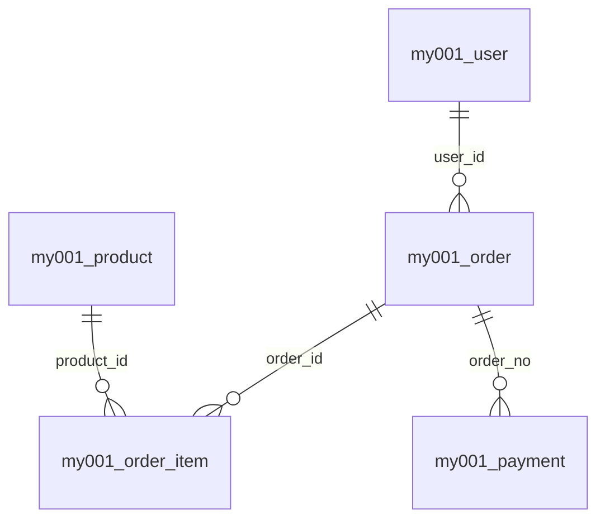

# 第三步：业务过程识别与粒度声明

> 目标：通过表关系网识别业务过程（总线矩阵的行），并同步声明每个过程的粒度——不声明粒度的业务过程识别没有意义。

---

## 1. 输入

第二步输出 `dwm_field_tag_result`（统一标注结果表），按条件过滤获取：

| 过滤条件 | 产出 | 用途 |
|---------|------|------|
| `core_tag IN ('业务键','代理键','外键')` | ID清单 | 画表关系图 |
| `core_tag='外键' AND ref_table IS NOT NULL` | 外键关系清单 | 连线主依据 |
| `fact_candidate='N' AND core_tag='业务键'` | 主表候选 | 维度候选池 |
| `core_tag IN ('可加度量','半可加度量','不可加度量')` | 度量清单 | 业务过程判定 |
| `core_tag='业务时间'` | 业务时间清单 | 业务过程判定 |
| 按 `ods_table_name` 聚合 `grain_hint` | 粒度候选 | 粒度声明起点 |

### 1.1 接口数据无主键降级策略

> 接口数据（API/文件/消息队列）通常无 PK/FK 约束，第二步证据链上限仅 5 分（缺源约束 4 分）。需在本步骤通过数据画像补充证据。

| 场景 | 降级处理 | 操作方法 |
|------|---------|---------|
| 无主键 | 数据画像发现天然业务键 | 对候选列跑唯一率，≥ 99.9% + 空值率 ≤ 1% → 业务键候选 |
| 无外键约束 | JOIN 命中率发现关系 | 候选字段与目标表 LEFT JOIN，`miss_rate ≤ 1%` → 外键候选 |
| 联合键才唯一 | 逐步增加组合字段 | 找满足唯一性的最小字段集 → 粒度键 |
| 同名字段无约束 | 值域匹配作弱证据 | 类型一致 + 值域重叠度 > 95% → 候选关系，需人工确认 |

**回写要求**：画像发现的业务键/外键需回写 `dwm_field_tag_result` 的 `core_tag`、`ref_table`、`ref_column`、`evidence_score`、`confidence`。

```sql
-- 唯一率分析（发现天然业务键）
SELECT
  COUNT(*) AS total,
  COUNT(DISTINCT candidate_col) AS distinct_cnt,
  SUM(CASE WHEN candidate_col IS NULL THEN 1 ELSE 0 END) AS null_cnt
FROM ods_xxx;

-- JOIN 命中率分析（发现外键关系）
SELECT
  COUNT(1) AS ref_cnt,
  SUM(CASE WHEN b.target_col IS NULL THEN 1 ELSE 0 END) AS miss_cnt,
  ROUND(SUM(CASE WHEN b.target_col IS NULL THEN 1 ELSE 0 END) / COUNT(1), 4) AS miss_rate
FROM ods_source a
LEFT JOIN ods_target b ON a.source_col = b.target_col
WHERE a.source_col IS NOT NULL;
```

---

## 2. 实施步骤

### 2.1 画表关系图（手段，非独立交付）

1. 以外键关系清单为主线画连线（不是仅靠同名字段）。
2. 对同名 ID 做补充候选，再做语义核验（实体含义、值域、join 命中率）。
3. 区分角色：
   - 主表：被引用为主、实体属性稳定（维度候选）
   - 引用表：引用多个实体且承载行为（事实候选）
4. **接口数据补充**：对第二步标记为`待确认`的外键字段，通过实际 JOIN 验证命中率后确认或排除。
5. 产出中间结果写入 `dwm_table_relation`（见§3.1）和 `dwm_table_profile`（见§3.2）。

### 2.2 识别业务过程并归组主题域

1. 逐表按四类证据评估：时间证据、度量证据、关联证据、增长证据。
2. 给出判定结果：`fact`（业务过程）/ `dimension`（维度实体）/ `config`（配置字典）/ `exclude`（排除）。
3. 对无数值但有行为轨迹的表，标记为"无度量业务过程候选（factless）"，`table_role=fact`，在 `role_evidence` 中注明 factless。
4. 形成标准命名：如下单、支付、退款、浏览。
5. **主题域归组（必做）**：将已识别的业务过程按业务相似性归入主题域：
   - 先自底向上：按业务过程的实体关系和业务链路自然聚类
   - 再自顶向下：对照企业价值链校验分组合理性
   - 命名规则：`XX域`（如交易域、库存域、用户域、财务域）
   - 一个业务过程只能归属一个主题域
6. 回填第一步数据源注册表和ODS表清单中的 `subject_area` 字段。

### 2.3 声明粒度

1. 按业务过程写一句话粒度声明（例：一行一笔支付交易）。
2. 识别承载粒度的键：主键或联合键。
3. 做唯一性校验：`COUNT(*)` 对比 `COUNT(DISTINCT 粒度键)`。
4. 若不唯一，回退修正：
   - 补联合键
   - 或下钻到更细明细层
5. **接口数据无主键时**：通过 §1.1 的唯一率分析发现天然键或联合键作为粒度键。

---

## 3. 输出

> 延续第二步原则：结构化落表，可查询、可回写、可追溯。
>
> 产出整合为 **2 张结构化表 + 1 张可视化图**。各类子清单通过 SQL 过滤获得，不再单独维护。
> **产出格式规范详见总线矩阵构建指南 §8**

### 3.1 `dwm_table_relation`（表关系台账）

> 一行一对关系。记录表间字段级关联，是表关系图的数据基础。
>
> **产出格式：数据库表 / CSV（格式规范详见总线矩阵构建指南）**

#### 字段定义

| 字段名 | 中文说明 | 是否必填 | 取值/规则 |
|--------|----------|:--:|-----------|
| source_code | 数据源编码 | 是 | 关联第一步数据源注册表 |
| source_table | 来源表（外键所在表） | 是 | ODS 表名 |
| source_column | 来源字段 | 是 | 外键字段名 |
| target_table | 目标表（被引用表） | 是 | ODS 表名 |
| target_column | 目标字段 | 是 | 被引用字段名 |
| relation_evidence | 关系证据来源 | 是 | `FK约束` / `JOIN验证` / `命名匹配` / `文档声明` |
| join_total | JOIN 总行数 | 是 | LEFT JOIN 后 source 侧总行数 |
| join_miss_count | JOIN 未命中行数 | 是 | target 侧为 NULL 的行数 |
| join_miss_rate | JOIN 缺失率 | 是 | `miss_count / total`，≤ 1% 为合格 |
| confidence | 置信度 | 是 | 高 / 中 / 低 |
| review_status | 审核状态 | 是 | `approved` / `pending` / `reject` |
| updated_at | 更新时间 | 是 | 最近修改时间 |

> 主键：`source_table + source_column + target_table + target_column`

#### 示例数据

| source_code | source_table | source_column | target_table | target_column | relation_evidence | join_total | join_miss_count | join_miss_rate | confidence | review_status |
|---|---|---|---|---|---|---:|---:|---|---|---|
| my001 | my001_order | user_id | my001_user | user_id | FK约束 | 5000000 | 2350 | 0.0005 | 高 | approved |
| my001 | my001_order_item | order_id | my001_order | order_id | FK约束 | 28000000 | 0 | 0.0000 | 高 | approved |
| my001 | my001_order_item | product_id | my001_product | product_id | FK约束 | 28000000 | 156 | 0.0000 | 高 | approved |
| api001 | api001_payment | currency_code | api001_exchange_rate | currency_code | JOIN验证 | 1200000 | 8500 | 0.0071 | 中 | pending |

> 第 4 行：接口数据无 FK 约束，通过 JOIN 验证发现关系，miss_rate 偏高（0.71%），标记 pending 待业务确认。

### 3.2 `dwm_table_profile`（表角色画像表）

> 一行一张表。整合表角色判定、业务过程识别、主题域归组、粒度声明与校验。
>
> **产出格式：数据库表 / CSV（格式规范详见总线矩阵构建指南）**

#### 字段定义

| 字段名 | 中文说明 | 是否必填 | 取值/规则 |
|--------|----------|:--:|-----------|
| source_code | 数据源编码 | 是 | 关联第一步数据源注册表 |
| ods_table_name | ODS 表名 | 是 | 主键 |
| table_role | 表角色 | 是 | `fact` / `dimension` / `config` / `exclude` |
| role_evidence | 角色判定依据 | 是 | 四类证据综合说明（时间/度量/关联/增长） |
| business_process | 业务过程名称 | 条件 | `table_role=fact` 时必填 |
| bp_standard_name | 业务过程标准命名 | 条件 | `table_role=fact` 时必填，如"下单""支付" |
| bp_desc | 业务过程描述 | 条件 | `table_role=fact` 时必填，一句话业务动作描述 |
| subject_area | 主题域 | 是 | `XX域`（如交易域、用户域），exclude 可留空 |
| subject_area_basis | 主题域归组依据 | 是 | 说明归组理由，exclude 可留空 |
| grain_statement | 粒度声明 | 条件 | `table_role IN (fact, dimension)` 时必填 |
| grain_keys | 粒度键 | 条件 | `table_role IN (fact, dimension)` 时必填，逗号分隔 |
| grain_total_count | 粒度校验-总行数 | 条件 | `COUNT(*)` 结果 |
| grain_distinct_count | 粒度校验-去重数 | 条件 | `COUNT(DISTINCT 粒度键)` 结果 |
| grain_check_result | 粒度校验结果 | 条件 | `pass` / `fail` |
| fact_candidate_final | 事实候选最终判定 | 是 | `Y(确认)` / `N`，覆盖第二步初判 |
| exclude_reason | 排除原因 | 条件 | `table_role=exclude` 时必填 |
| review_status | 审核状态 | 是 | `approved` / `pending` / `reject` |
| updated_at | 更新时间 | 是 | 最近修改时间 |

> 主键：`ods_table_name`

#### 示例数据

**事实表（fact）**：

| 字段 | 值 |
|------|---|
| source_code | my001 |
| ods_table_name | my001_order |
| table_role | fact |
| role_evidence | 有 order_time（业务时间）+ total_amount（度量）+ 引用 user/product 2 个实体 + 日增 5 万行 |
| business_process | 客户下单 |
| bp_standard_name | 下单 |
| bp_desc | 客户在平台提交购买订单 |
| subject_area | 交易域 |
| subject_area_basis | 订单是交易主链路核心环节 |
| grain_statement | 一行一笔订单 |
| grain_keys | order_no |
| grain_total_count | 5000000 |
| grain_distinct_count | 4999998 |
| grain_check_result | pass |
| fact_candidate_final | Y(确认) |
| exclude_reason | |
| review_status | approved |

**维度表（dimension）**：

| 字段 | 值 |
|------|---|
| source_code | my001 |
| ods_table_name | my001_user |
| table_role | dimension |
| role_evidence | 被 order/order_item/payment 3 张事实表引用，属性稳定，无度量，行数 80 万 |
| business_process | |
| bp_standard_name | |
| bp_desc | |
| subject_area | 用户域 |
| subject_area_basis | 用户是独立实体域，跨多个业务过程共享 |
| grain_statement | 一行一个用户 |
| grain_keys | user_id |
| grain_total_count | 800000 |
| grain_distinct_count | 800000 |
| grain_check_result | pass |
| fact_candidate_final | N |
| exclude_reason | |
| review_status | approved |

**配置表（config）**：

| 字段 | 值 |
|------|---|
| source_code | my001 |
| ods_table_name | my001_sys_config |
| table_role | config |
| role_evidence | 无外键引用，无度量，行数 12，静态配置 |
| business_process | |
| bp_standard_name | |
| bp_desc | |
| subject_area | 系统域 |
| subject_area_basis | 系统级全局配置 |
| grain_statement | |
| grain_keys | |
| grain_total_count | |
| grain_distinct_count | |
| grain_check_result | |
| fact_candidate_final | N |
| exclude_reason | |
| review_status | approved |

**排除表（exclude）**：

| 字段 | 值 |
|------|---|
| source_code | my001 |
| ods_table_name | my001_etl_log |
| table_role | exclude |
| role_evidence | 技术日志，无业务语义，仅 ETL 监控使用 |
| business_process | |
| bp_standard_name | |
| bp_desc | |
| subject_area | |
| subject_area_basis | |
| grain_statement | |
| grain_keys | |
| grain_total_count | |
| grain_distinct_count | |
| grain_check_result | |
| fact_candidate_final | N |
| exclude_reason | ETL 运行日志，无业务建模价值 |
| review_status | approved |

### 3.3 表关系图（可视化，从 `dwm_table_relation` 生成）

> 非独立数据交付物，从 `dwm_table_relation` 数据自动生成，用于辅助人工审查。
>
> **产出格式：Mermaid ER 图示例 / 可视化工具导出（格式规范详见总线矩阵构建指南）**

**示例**：



> 图中节点按 `dwm_table_profile.table_role` 着色：fact=蓝色、dimension=绿色、config=灰色。

### 3.4 派生查询（无需单独维护）

> 以下子清单通过 SQL 从 `dwm_table_profile` / `dwm_table_relation` 过滤获得，不再作为独立产出物：

```sql
-- 维度候选表清单
SELECT ods_table_name, grain_statement, grain_keys, subject_area
FROM dwm_table_profile WHERE table_role = 'dimension';

-- 事实候选表清单
SELECT ods_table_name, business_process, bp_standard_name, grain_statement, subject_area
FROM dwm_table_profile WHERE table_role = 'fact';

-- 排除清单
SELECT ods_table_name, exclude_reason
FROM dwm_table_profile WHERE table_role = 'exclude';

-- 业务过程候选清单（含标准命名）
SELECT ods_table_name, business_process, bp_standard_name, bp_desc, subject_area
FROM dwm_table_profile WHERE table_role = 'fact';

-- 主题域清单（含归组依据与业务过程列表）
SELECT subject_area,
       GROUP_CONCAT(bp_standard_name) AS business_processes,
       subject_area_basis
FROM dwm_table_profile
WHERE table_role = 'fact'
GROUP BY subject_area, subject_area_basis;

-- 业务过程-主题域归属表（1:1 映射）
SELECT bp_standard_name, subject_area
FROM dwm_table_profile WHERE business_process IS NOT NULL;

-- 粒度声明与校验结果
SELECT ods_table_name, grain_statement, grain_keys,
       grain_total_count, grain_distinct_count, grain_check_result
FROM dwm_table_profile WHERE grain_statement IS NOT NULL;

-- ID 关系台账（完整关系明细）
SELECT * FROM dwm_table_relation WHERE review_status != 'reject';
```

---

## 4. 验收标准

1. `dwm_table_relation` 中所有 `review_status=approved` 的关系满足 `join_miss_rate ≤ 1%`
2. `dwm_table_profile` 中当批次每张表都有明确的 `table_role`
3. 所有 `table_role=fact` 的表有完整的 `business_process`、`bp_standard_name`、`subject_area`、`grain_statement`
4. 所有 `table_role=dimension` 的表有 `grain_statement` 和 `grain_keys`
5. 粒度键通过唯一性校验（`grain_check_result=pass`），不通过需回退修正
6. 每个业务过程只归属一个主题域（`bp_standard_name` → `subject_area` 为 1:1）
7. 高风险歧义关系已人工确认（`review_status=approved`）

---

## 5. 与下一步衔接

- `dwm_table_profile WHERE table_role='fact'` → 第四步确定事实类型与度量归属
- `dwm_table_profile WHERE table_role='dimension'` → 第四步提取维度、收敛一致性维度
- `dwm_table_relation` → 第四步构建总线矩阵的维度-事实关联线
- `subject_area` 回填到第一步 ODS 表清单，确保上下游语义统一
- `fact_candidate_final` 覆盖第二步 `dwm_field_tag_result` 中的 `fact_candidate` 初判值
